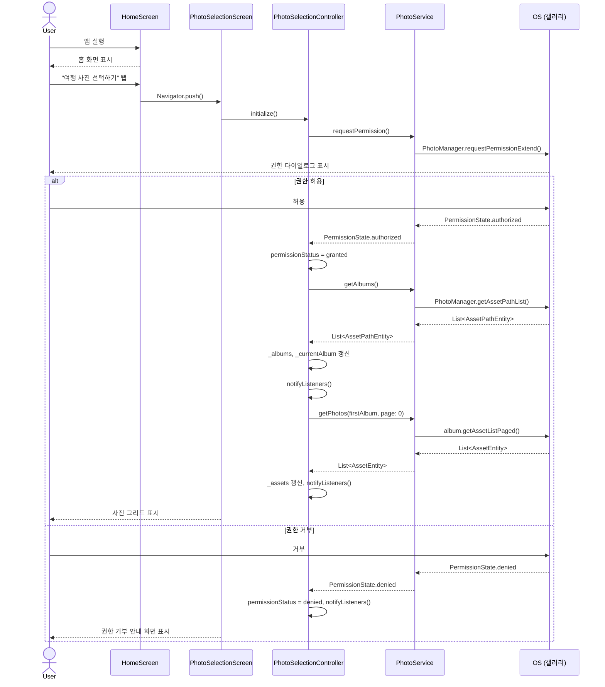
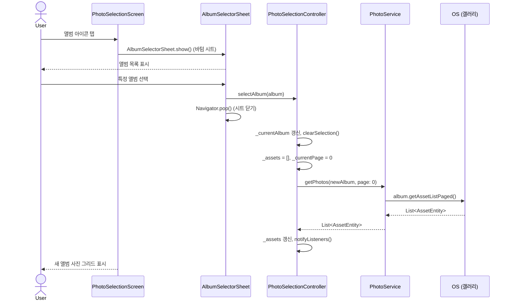
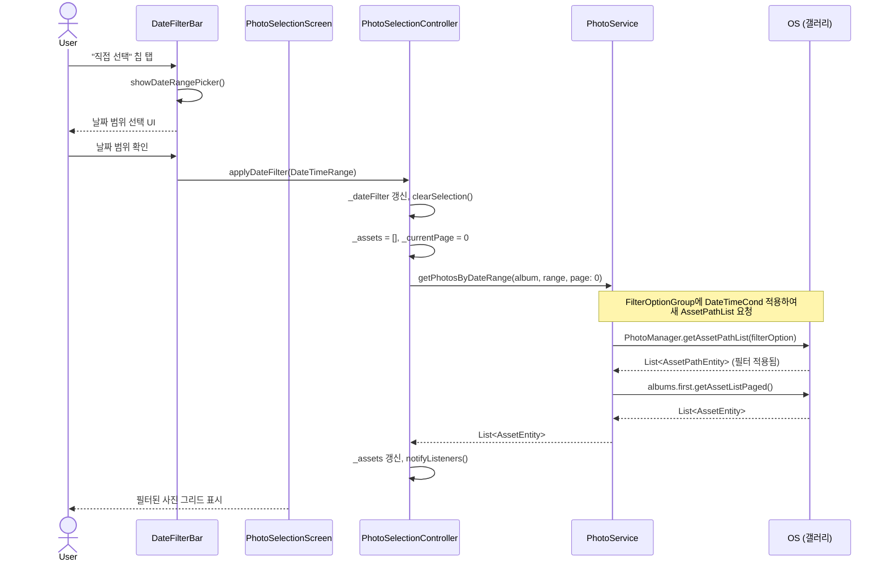
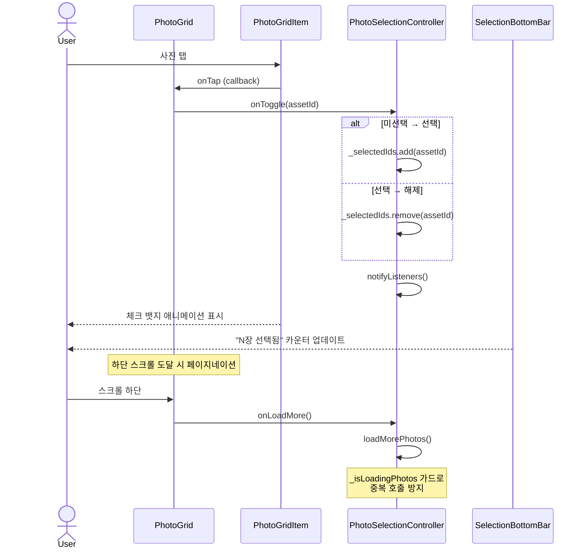
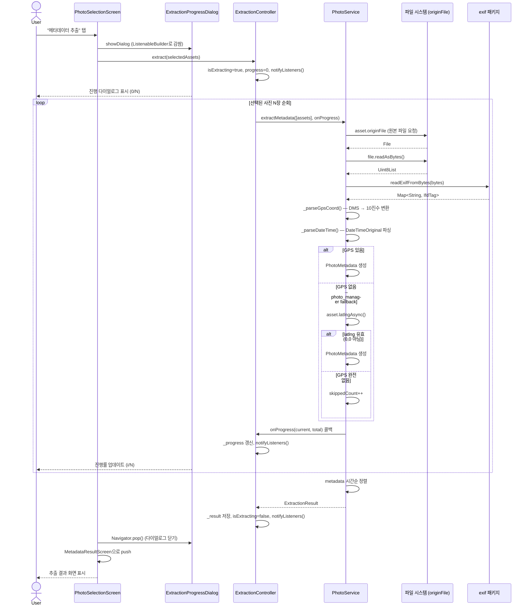
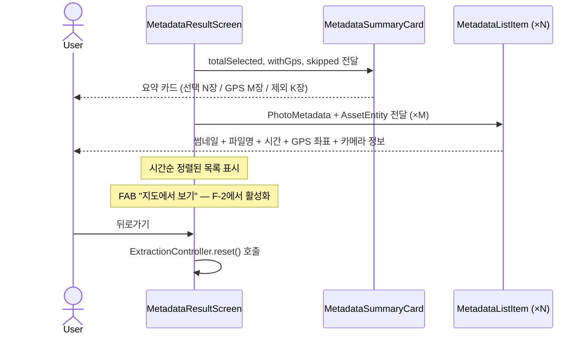

# 시퀀스 다이어그램

주요 유저 시나리오별 컴포넌트 간 상호작용을 정의한다.

---

## 1. 앱 시작 및 권한 요청

앱 최초 실행 시 사진첩 접근 권한을 요청하고, 결과에 따라 다른 화면으로 분기한다.



---

## 2. 앨범 변경



---

## 3. 날짜 범위 필터



---

## 4. 사진 선택 (멀티셀렉트)



---

## 5. 메타데이터 추출 (핵심 플로우)

GPS가 있는 사진만 결과에 포함되고, GPS 없는 사진은 `skippedCount`로 집계된다.



---

## 6. 결과 화면 표시



---

## GPS 좌표 변환 알고리즘

EXIF GPS는 **DMS(도·분·초)** 형식의 `IfdRatios`로 저장된다. 지도 SDK에서 사용하는 **10진수 위경도**로 변환한다.

```
10진수 = 도(D) + 분(M)/60 + 초(S)/3600

남위(S), 서경(W)인 경우 음수 처리: decimal = -decimal

예시:
  GPS GPSLatitude:    [37/1, 33/1, 1200/100]  →  37° 33' 12.00"
  GPS GPSLatitudeRef: N
  → 37 + 33/60 + 12/3600 = 37.553333...
```

각 IfdRatio 값은 `numerator / denominator`로 소수점 표현:

| IfdRatios index | 의미 | 예시 값 |
|-----------------|------|---------|
| `list[0]` | 도 (Degrees) | `37/1` → 37.0 |
| `list[1]` | 분 (Minutes) | `33/1` → 33.0 |
| `list[2]` | 초 (Seconds) | `1200/100` → 12.0 |
